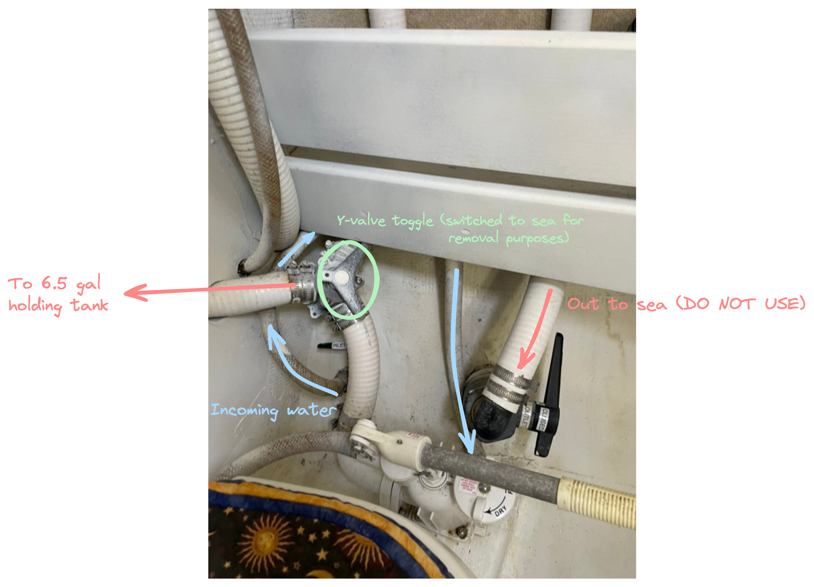
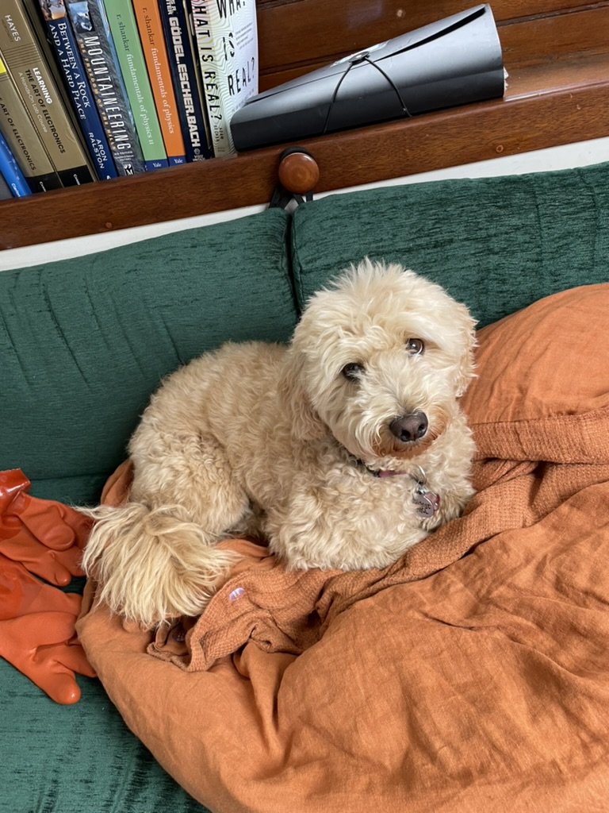

# 9/28/24 - Removing the head

> "The Pequod’s whale being decapitated and the body stripped, the head was hoisted against the ship’s side- about half way out of the sea, so that it might yet in great part be buoyed up by its native element".
>
> **Herman Melville, "Moby Dick"**

The Endurance has a small head just aft of the v-berth cabin. It's a simple and easy setup: water is pumped in from the sea into a toilet, business done, then the waste is flushed out into either a blackwater storage tank or into the ocean itself. 

Simple - except ... Endurance's head was *old*. Old, and therefore stinky. On the shore, water is usually lightly treated in such a way that bacteria can't grow in it. It's why tapwater, despite being stuck in pipes for a while, is safe to drink and standing toilet water doesn't stink. Seawater both *isn't treated* and has *tons* of lil baby microorganisms making everything stink up - especially when they're stuck in a toilet bowl. Marine heads (and their tubing) don't usually have terribly long lives - only a couple years before an overhaul is needed.

To further complicate matters, Endurance's holding tank was *only 6.5 gallons*. 

Time to strip it all out and replace it.

---

Four hours later ... it's done. We threw on some loud music to power through the stink & got it all out, though our olfactory senses may never recover from the ordeal. 

Gross, gross, GROSS. Ugh. 

Farewell, old PHII and world's smallest holding tank. I'm thinking now I'll replace them with an electric toilet - first-world solutions to a not-so-first-world problem. 

And Roxanne, the (unofficial, part-time) ship's hound. 

