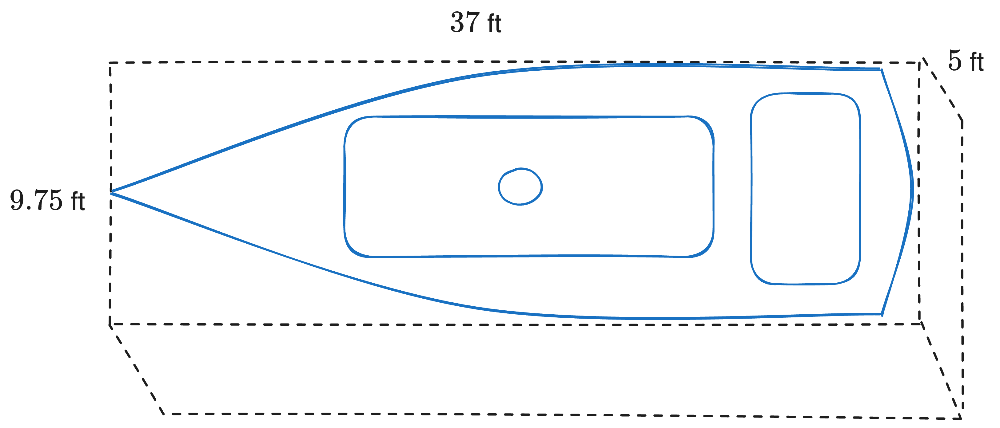

# 9/24/24 - Mold

> “...to the last I grapple with thee; from hell's heart I stab at thee; for hate's sake I spit my last breath at thee.”
>
> **Herman Melville, "Moby Dick"**

When I first bought Andromeda a few months ago, the previous owner mentioned she'd been sitting in her berth for a year without interacting with her much. I,  being *utterly* inexperienced, didn't think much of it at the time. Unfortunately, it turns out that a year in a berth in the PNW with no ventilation means something that's a bogeyman to most sailors: *mold*. 

After seeing some for the first time, I ran around the ship in a panic looking for more. Fortunately, the living spaces didn't have much; mostly it was restricted to the head (open water, no ventilation), under the sink (leaky pipe), in the rear two berths I'm using for storage (exposed passive vent) and beneath the old fresh water heater. There was very mild mildew growth in the V-berth and elsewhere in the living quarters.

### Regarding Mold

[Mold](https://en.wikipedia.org/wiki/Mold) and mildew are [fungi](https://en.wikipedia.org/wiki/Fungus) - eukaryotic organisms that tend to spread through airborne spores. 

> Apparently, one way that fungi can distinguished from other eukaryotic organisms (like bacteria, plants and animals) by the presence of *chitin* in their cell walls. 

 According to [this study](https://www.eurogypsum.org/wp-content/uploads/2015/05/N203.pdf), mold needs three things to grow:

1. **Wet**: relative humidity above 60%.
2. **Low light levels**: intense UV can kill mold, so it's difficult to grow outside unless it's got an easy food source. Even on nutritionally sparse interiors, varieties can grow if uninhibited by UV. 
3. **Still air**: for the spores to take root and grow.

Removal of any of these three means we make a hostile environment for mold. Right.

## Fungicide

First step: getting rid of what's already present. 

[Concrobium](https://www.homedepot.com/p/Concrobium-32-oz-Mold-Control-025326/100654126), bleach and vinegar all work against heavy concentrations of mold - but they're much better for small-yet-intense areas, like under my water heater. I wanted to make sure most of the mold on my entire boat was gone, so I used concrobium for areas of visible mold, then used an ozone generator.

Ozone has been [scientifically tested](https://doi.org/10.1080/01919510903043996) against a wide variety of molds, and found to be effective at killing it (including black mold!) - but only at high concentrations. Specifically, an ozone concentration of 35 ppm. Let's do some math to find out how to practically generate that much. 

Andromeda has an LoA of 37 feet, a beam of 9.75 feet and interior height of maybe 5 feet. 

If we approximate Andromeda as just a box, that's an interior volume of 1803 cubic feet. Now, Andromeda's a sailboat-shape, not a box, so maybe shave off 1/3 of that number, for an (approximate) interior volume of 1200 cubic feet. 

My ozone generator disperses 15,000 mg/hr. I want a concentration of 35 ppm ozone[^2] to inactivate all the mold air can reach. 1 g of ozone per cubic meter is [equivalently](https://duckduckgo.com/?q=ozone+ppm+conversions&ia=web) 467 ppm ozone in the air. 

Ideal case has no air movement into or out of the boat and the ozone is stable. After 1 hour I'll have 15 grams of ozone. 1200 cubic feet is about 34 cubic meters, so after 1 hour of running my machine I'll have 0.44 g / m$^3$ ozone, assuming the ozone disperses throughout the whole boat, or 205.48 ppm ozone. That's the ideal case - in reality, I'll allow for 2/3 of the ozone to escape the boat through passive vents and air holes, leaving 68.49 ppm after 1 hour. But I wanted over-kill, so ran the ozone generator for an extra thirty minutes.

Everything should be dead now - so time to prevent future growth.

[^2]: https://www.tandfonline.com/doi/abs/10.1080/01919510903043996
## Mold Prevention

Andromeda doesn't have good ventilation when she's closed up. I have two small passive cowl vents, one at the front, the other at the rear, and a decaying solar mushroom vent. So, lots of still air - she's the perfect environment for mold on a wet day, which happens often here. 

So I need ventilation. But that'll take time and parts - for now, I've killed off the local mold population, so I need a temporary solution until then. 

First - I got a dehumidifer to keep the interior air at 45% humidity until I can get some active ventilation set up. Next, I grabbed some borax, TSP and washing soda from the hardware store to make something called [formula B](https://goodoldboat.com/clean-mildew-sailboat/). 

> **Formula B**:
> - 1 gallon of warm water
> - 1/4 cup borax
> - 2 tablespoons of TSP
> - 2 tablespoons of washing soda 
> 
> Mix in a bucket then spray with a spray-bottle. Scrub in with a brush and let sit for a bit, then remove any residue with a shop-vac. 

The key here is the borax - it's toxic to mold but not to humans. Trace amounts of it will remain on the surface it was sprayed on, and can be used on pretty much every surface (though maybe not on beds), so mold shouldn't grow on that surface for a long while, even given ideal conditions. I sprayed this on most carpeted and hardwood surfaces, especially where mold had grown previously, then rubbed it in with a brush, removing the excess with a little shop-vac I had on hand. 

Over the next few days I'll get ventilation set up and start attacking the ancient (and stinky) bathroom. 