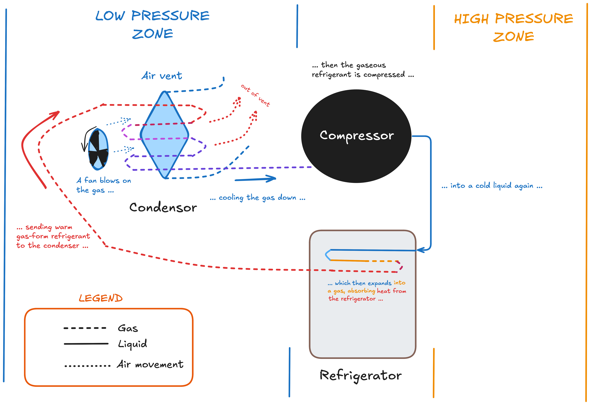
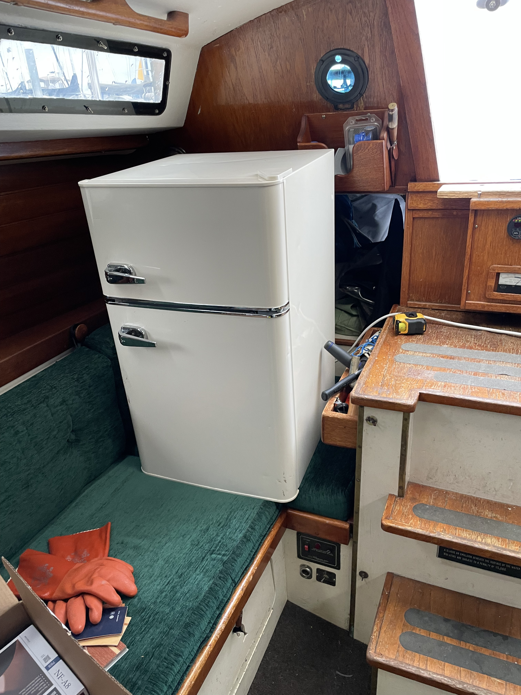

# 10/4/24 - Refrigerator troubleshooting

The refrigerator on Endurance doesn't work. I spent a bit of time trying to figure out why - interestingly, most refrigerators work a lot like car A/C systems:

Here's the routine: a compressor compresses low-pressure *vapor* refrigerant into high-pressure *liquid* refrigerant. This high pressure refrigerant expands inside the refrigerator, pulling ambient heat out of the refrigerator. This relatively warm gas is sent in front of a fan, which blows on pipes around it and chilling the vapor-form refrigerant again, before it is sent into a compressor and re-compressed once more.

The entire process removes only a *little* bit of heat each cycle, but so long as the refrigerator has enough insulation to maintain its temperature and the fan is strong enough to remove heat from the system, it works well after a period of time.

---

So, I spent a bit of time troubleshooting.

Endurance has an Adler Barbour BD 2.5 ColdMachine - an old, *old* piece of technology dating from the late nineties, using a refrigerant totally outlawed in most of the world now (R-12) because it's a really potent greenhouse gas. The compressor wasn't turning on. 

Some troubleshooting later - turned out the refrigerant was **empty**. Meaning I had a leak somewhere. 

Meaning, I could either hunt down a source of R12 (and the leak) - no thank you in 2024 - retrofit my current system to use modern refrigerant - difficult in Washington (refrigerant sale banned) - or buy a new refrigerator. 

I think I'll go with the last option. It's simple, easy and the system will come pre-charged. Until then, I have a temporary solution:

