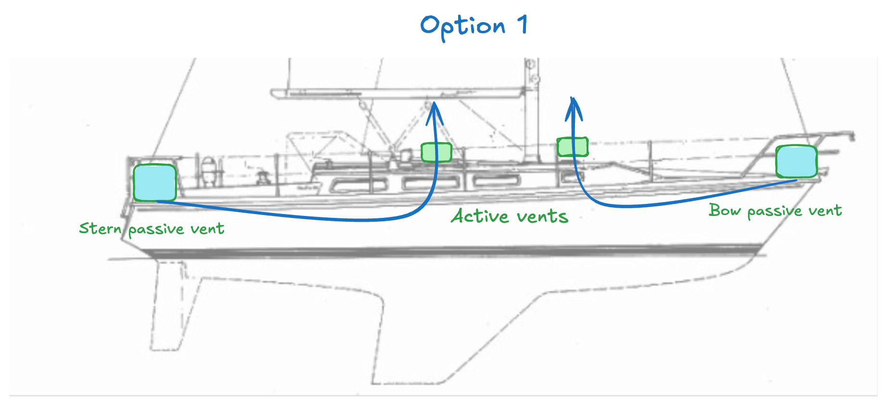
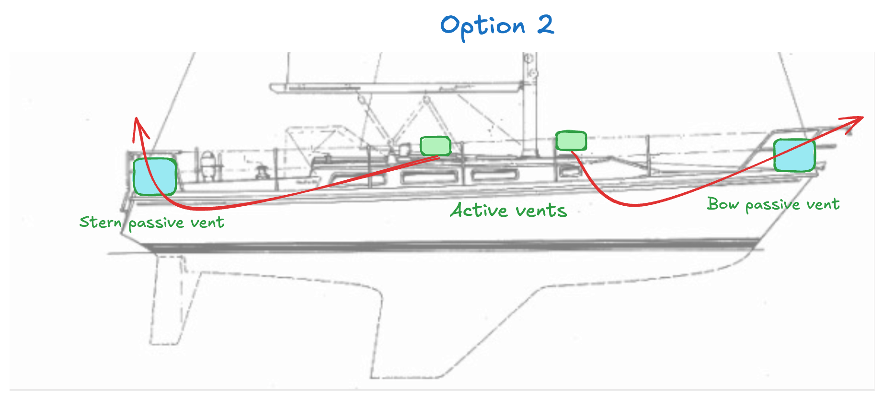
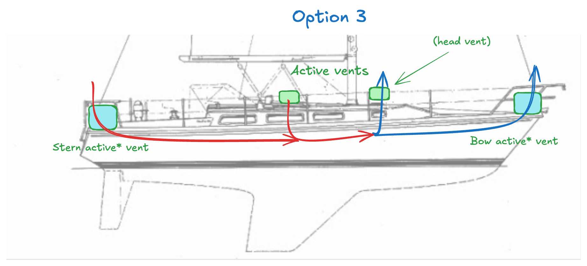

Air is a gas mixture, and behaves according to the laws of fluid dynamics, flowing from areas of high pressure to low. 

1. **Option 1**: active vents as exhaust.

The active vents would act as *exhaust*, making the cabin a low-pressure zone. Air would move in through the passive vents. 

2. **Option 2**: active fans as intakes. 

A higher pressure would be created in the boat - the bow and stern vents would exhaust air inside the boat. Nice, but functionally similar and the head would be venting *in* rather than *out* ... which might get stinky at some point.

3. **Option 3**: make passive vents into active ones, linear airflow. 

This one would take the most work, requiring I run some 12V lines up to the bow and stern and install fans on both. However, it would mean I can exhaust the head while maintaining a good airflow. 
